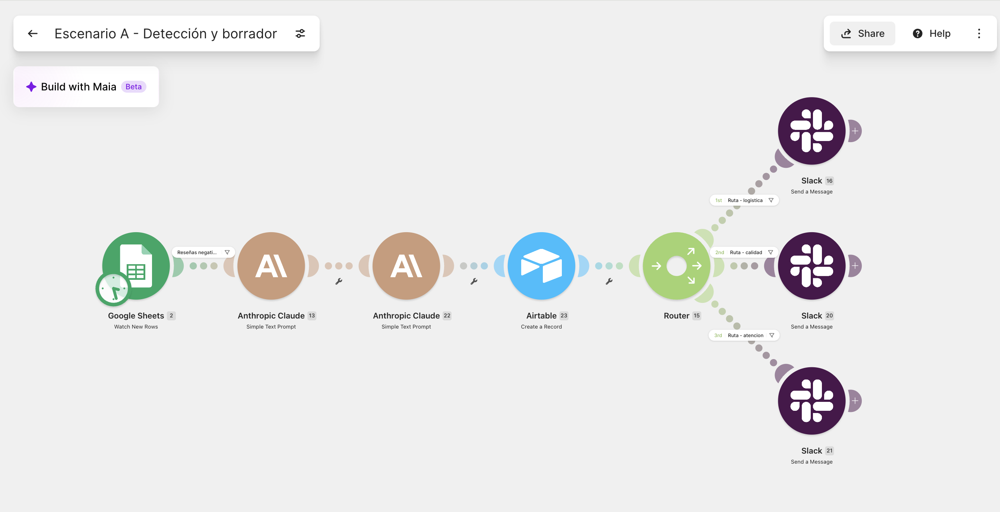
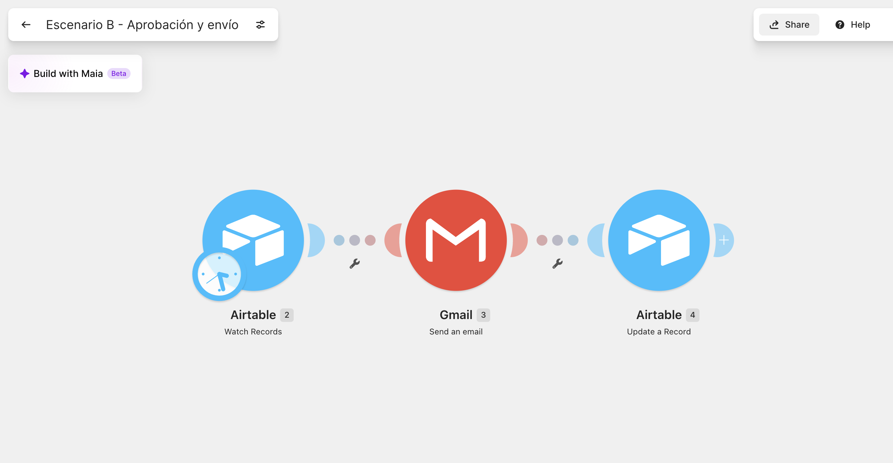
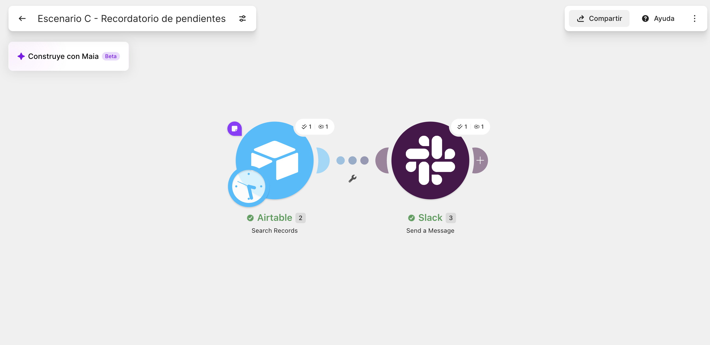
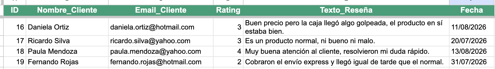
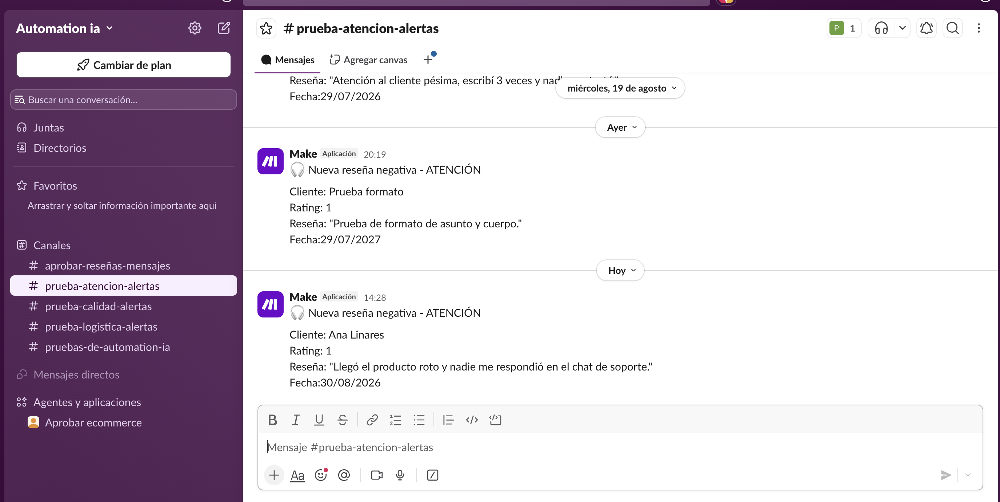
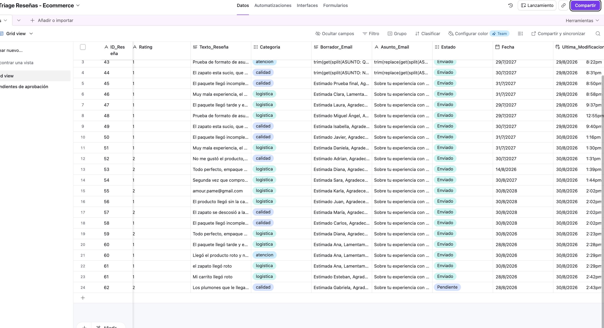
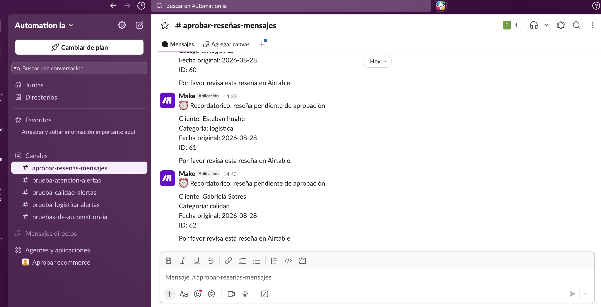
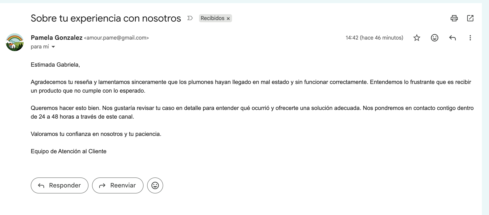

# Triage de Reseñas Negativas — Automatización E-commerce

Proyecto de portafolio de automatización para e-commerce, construido con **Make** (plan gratuito), **Airtable**, **Anthropic Claude**, **Slack** y **Gmail**.

Simula un sistema real usado por equipos de atención al cliente: detecta reseñas negativas, las clasifica automáticamente con IA, redacta un borrador de respuesta al cliente, y **solo lo envía después de aprobación humana** — con un recordatorio automático si nadie revisa a tiempo.

---

## 🎯 El problema de negocio

Una tienda de e-commerce recibe decenas de reseñas al día. Las negativas (1-2 estrellas) suelen perderse entre las buenas, y cuando alguien las revisa, ya pasaron días — el cliente se frustra más, y el problema de fondo (envío, calidad, atención) sigue repitiéndose sin que nadie lo note a tiempo.

Este sistema resuelve tres cosas:
1. **Detecta** la reseña negativa apenas llega.
2. **Clasifica** el motivo de la queja y avisa al equipo correcto (no a todos).
3. **Prepara una respuesta** para el cliente, pero nunca la envía sin que un humano la revise primero.

---

## 🗺️ Arquitectura: 3 escenarios independientes

El proyecto se divide en 3 escenarios de Make, cada uno con una responsabilidad distinta. Se usa el patrón de **"escenarios separados para forzar aprobación humana"**: Make no puede pausar un escenario a mitad de camino esperando una acción humana que puede tardar horas o días, así que cada fase que depende de un humano vive en su propio escenario, con su propio trigger.

### Escenario A — Detección y borrador

```
Google Sheets (nueva fila)
        │
        ▼
   Filtro: Rating ≤ 2
        │
        ▼
 Claude #1: clasifica
 (logistica / calidad / atencion)
        │
        ▼
 Claude #2: redacta el
 cuerpo del email al cliente
        │
        ▼
   Airtable: guarda todo
   (Estado = "Pendiente")
        │
        ▼
      Router
   ┌────┼────┐
   ▼    ▼    ▼
Slack Slack Slack
Logíst Calid Atenc
```

**Qué hace cada pieza:**
| Módulo | Función |
|---|---|
| Google Sheets — Watch New Rows | Detecta reseñas nuevas (simula un formulario tipo Trustpilot/Google) |
| Filtro | Deja pasar solo Rating ≤ 2, para no gastar IA en reseñas buenas |
| Claude #1 (Haiku 4.5) | Clasifica la queja en una palabra: `logistica`, `calidad` o `atencion` |
| Claude #2 (Haiku 4.5) | Redacta el cuerpo del email de respuesta al cliente, en tono empático |
| Airtable — Create Record | Guarda el registro completo con Estado = `Pendiente` |
| Router + 3 filtros | Enruta según la categoría clasificada |
| Slack (x3 canales) | Avisa al equipo correcto: `logistica-alertas`, `calidad-alertas`, `atencion-alertas` |

### Escenario B — Aprobación y envío

```
Airtable (Watch Records)
  Trigger: Estado = "Aprobado"
        │
        ▼
      Gmail
  Envía el email real
        │
        ▼
   Airtable: Estado = "Enviado"
```

Este escenario se dispara **únicamente** cuando un humano cambia manualmente el `Estado` de un registro a `Aprobado` en Airtable. Si nadie lo aprueba, el email nunca sale — no hay riesgo de que la IA le escriba a un cliente sin supervisión.

### Escenario C — Recordatorio de aprobación pendiente

```
Trigger por tiempo (cada 24h)
        │
        ▼
Airtable — Search Records
Estado = "Pendiente" Y
más de 48h desde la fecha
        │
        ▼
      Slack
Recordatorio en #aprobar-reseñas-mensajes
```

Revisa periódicamente si hay reseñas "olvidadas" en estado Pendiente por más de 48 horas (el mismo plazo que el borrador de email le promete al cliente), y avisa al equipo para que no se les escape ningún caso.

---

## 🗂️ Modelo de datos (Airtable)

Tabla única: **`Reseñas`**

| Campo | Tipo | Propósito |
|---|---|---|
| `ID_Reseña` | Single line text | Igual al ID de origen en Google Sheets, para trazabilidad |
| `Nombre_Cliente` | Single line text | Nombre del cliente |
| `Email_Cliente` | Email | Destino real del correo de respuesta |
| `Rating` | Number | 1-5 estrellas |
| `Texto_Reseña` | Long text | Contenido original de la queja |
| `Categoria` | Single select (`logistica` / `calidad` / `atencion`) | Resultado de la clasificación por IA |
| `Borrador_Email` | Long text | Cuerpo del email generado por IA |
| `Asunto_Email` | Single line text | Asunto del correo (texto fijo, ver decisión de diseño abajo) |
| `Estado` | Single select (`Pendiente` / `Aprobado` / `Enviado`) | Controla el flujo de aprobación entre escenarios — es el "puente" entre A y B |
| `Fecha` | Date | Fecha original de la reseña |
| `Ultima_Modificacion` | Last modified time (vigila solo el campo `Estado`) | Necesario para que el trigger de Airtable en Make detecte cambios de estado |

**Vista adicional:** `Pendientes de aprobación` — vista filtrada (`Estado = Pendiente`) pensada para que un humano revise rápidamente solo lo que necesita su atención, sin scrollear entre registros ya resueltos. Simula cómo trabajaría un equipo con volumen alto de reseñas diarias.

---

## 🛡️ Manejo de errores y resiliencia

**Filtro estricto de texto en el Router.** Los filtros que comparan la categoría (`Result = logistica`) son sensibles a mayúsculas/tildes exactas. Se resolvió pidiéndole a la IA, en el propio prompt, que respondiera siempre en minúsculas y sin tilde — y replicando ese mismo formato exacto en los filtros.

**Separación de Asunto y Cuerpo del email.** El primer intento (pedirle a la IA un solo texto con `ASUNTO: ... --- ...` y separarlo después con fórmulas `split`/`trim`/`get`) falló repetidamente por errores de sintaxis difíciles de depurar a ciegas. Se simplificó el diseño: la IA genera solo el cuerpo del email, y el asunto es un texto fijo — menos piezas movibles, menos puntos de falla. Lección de diseño: cuando una fórmula compleja falla varias veces sin causa clara, muchas veces conviene simplificar el diseño en vez de seguir depurando.

**Saltos de línea en el email HTML.** Gmail (modo Raw HTML) ignora saltos de línea simples. Se resolvió envolviendo el cuerpo del correo en una etiqueta `<pre style="white-space: pre-wrap;">`, que respeta el formato del texto tal como viene, sin necesitar funciones de reemplazo adicionales.

**Ningún envío sin aprobación humana.** El Escenario B solo se activa cuando el campo `Estado` cambia específicamente a `Aprobado` — el prompt del email también instruye explícitamente a la IA a *no prometer reembolsos ni compensaciones*, dejando esas decisiones al humano que aprueba.

**Recordatorio de reseñas olvidadas (Escenario C).** Si nadie aprueba una reseña en 48 horas, un escenario aparte avisa al equipo — evita que un caso se quede invisible para siempre en Airtable.

**Límite del plan gratuito de Make.** El plan gratuito permite máximo 2 escenarios activos simultáneamente. Con 3 escenarios en el proyecto, el Escenario C (recordatorio) se ejecuta bajo demanda (`Run once`) en lugar de estar siempre encendido — en un entorno de producción con plan pagado, correría de forma completamente autónoma.

---

## 💰 Comparativo de costos de IA

Usando **Claude Haiku 4.5** (el modelo más económico disponible, adecuado para tareas simples de clasificación y redacción corta):

| Tarea | Max Tokens | Costo aproximado por reseña |
|---|---|---|
| Clasificación (1 palabra) | 10 | ~0.31 créditos de IA |
| Redacción del cuerpo del email (~100 palabras) | 300 | Órdenes de magnitud similar, algo mayor por la respuesta más larga |

**Optimización aplicada:** el Max Tokens de la clasificación se redujo de 20 a 10, suficiente para las 3 palabras posibles de respuesta, reduciendo el costo por llamada sin arriesgar que la respuesta se corte.

**Decisión de diseño para controlar costos:** se descartó una arquitectura que hiciera 3 llamadas a la IA por reseña (clasificar + redactar cuerpo + redactar asunto). En su lugar, el asunto del email es un texto fijo, reduciendo a 2 llamadas de IA por reseña sin sacrificar personalización donde más importa (el cuerpo del mensaje).

Con un saldo de referencia de $5 USD en la API de Anthropic, el volumen de llamadas de este proyecto (decenas de pruebas) representa una fracción mínima del saldo — miles de reseñas podrían procesarse antes de agotarlo.

---

## 🧰 Herramientas usadas

- **Make** (plan gratuito) — orquestación de los 3 escenarios
- **Google Sheets** — simulación del formulario público de reseñas
- **Anthropic Claude (Haiku 4.5)** — clasificación y redacción de respuestas
- **Airtable** — base de datos central y "puente" entre escenarios
- **Slack** — alertas internas por equipo + recordatorios de pendientes
- **Gmail** — envío del email final al cliente

---

## 🎓 Habilidades demostradas

- Diseño de automatización multi-escenario con aprobación humana (Human-in-the-loop)
- Integración de IA generativa en un flujo de negocio real, con prompts diseñados para output estructurado y predecible
- Enrutamiento condicional (Router) basado en clasificación de IA
- Modelado de datos en Airtable como capa de estado entre procesos independientes
- Manejo de errores y resiliencia (recordatorios automáticos, filtros estrictos, control de formato)
- Optimización de costos de IA (elección de modelo, límite de tokens, arquitectura de llamadas)
- Diagnóstico y resolución iterativa de errores de sintaxis en fórmulas de bajo código

---

## 📹 Demo en video

- **Parte 1 — Escenarios A y B** (detección, clasificación, borrador, aprobación y envío): [Ver en YouTube](https://youtu.be/eXR8mVEOm_0)
- **Parte 2 — Escenario C** (recordatorio de aprobación pendiente): [Ver en YouTube](https://youtu.be/86BQiCZ4Wi8)

## 🔗 Recursos en vivo

- **Base de Airtable (vista de solo lectura, sin necesidad de cuenta):** [Ver base en Airtable](https://airtable.com/app1t1rI1moDNSqtC/shrEy5u6HNkZzIV0a)

---

## 🖼️ Capturas del proyecto

### Los 3 escenarios en Make

| Escenario A — Detección y borrador |
|---|
|  |

| Escenario B — Aprobación y envío | Escenario C — Recordatorio de pendientes |
|---|---|
|  |  |

### El flujo en acción

| Reseña simulada (Google Sheets) | Alerta en Slack |
|---|---|
|  |  |

| Registro en Airtable | Recordatorio de pendientes (Slack) |
|---|---|
|  |  |

### Email recibido por el cliente



---

## 🧩 Configuración técnica exportada

Cada escenario se puede exportar desde Make como un archivo "blueprint" (JSON), con la configuración completa de módulos, campos y conexiones:

- [`escenario-a-blueprint.json`](./assets/escenario-a-blueprint.json) — Detección y borrador
- [`escenario-b-blueprint.json`](./assets/escenario-b-blueprint.json) — Aprobación y envío
- [`escenario-c-blueprint.json`](./assets/escenario-c-blueprint.json) — Recordatorio de pendientes
